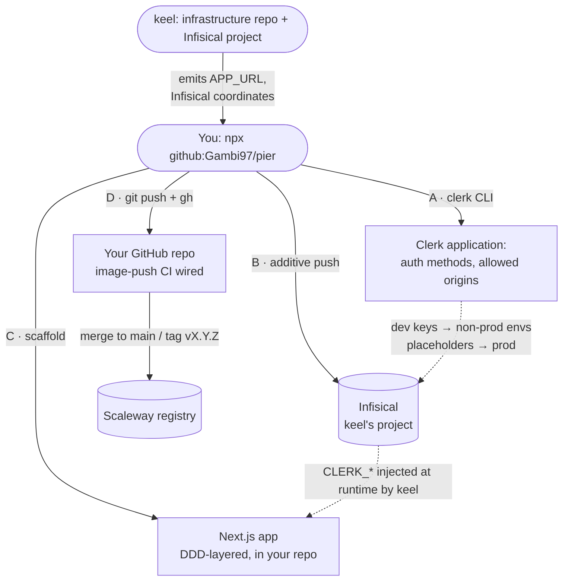

<h1 align="center">pier</h1>

<p align="center">
  One command from zero to working authentication for a keel-fleet app<br>(Clerk application + secrets in Infisical + a DDD Next.js scaffold). Only Node required.
</p>

<p align="center">
  <a href="https://github.com/Gambi97/pier/actions/workflows/ci.yml"></a>
  
  <a href="LICENSE"></a>
</p>

<p align="center">
  <a href="#quickstart">Quickstart</a> ·
  <a href="#why-pier">Why pier</a> ·
  <a href="#how-it-works">How it works</a> ·
  <a href="#what-gets-created-and-when">What gets created</a> ·
  <a href="#the-generated-repository">Generated repo</a> ·
  <a href="#faq">FAQ</a>
</p>

A pier is the gangway your users walk up to get on board. `pier` builds that
gangway for whatever you are shipping: it creates the identity application on
[Clerk](https://clerk.com), pushes the auth coordinates into the secret store
[keel](https://github.com/Gambi97/keel) already provisioned, and fills the
(empty) app repo you run it in with a DDD-layered [Next.js](https://nextjs.org)
app — provider, middleware, sign-in / sign-up pages, protected routes. You
create the repo and answer a couple of questions, and out comes a deployable
app repository you fully own.

Pier is the boarding point in a small fleet: **keel lays the infrastructure
spine, Pier is the pier people walk up to get on board, the app is the ship.**
Two reusable run-once bootstrappers, one bespoke app on top.

**Pier runs once, then leaves.** It is a bootstrapper, not a control plane. It
configures Clerk, wires the secrets, scaffolds the app into the repo you own,
pushes it, and exits. It never becomes a runtime dependency, has nothing to
update, and does not sit in the request path — the generated app talks to Clerk
directly, behind a seam you own.

- **No auth secrets in the repo, ever.** Provider keys land in Infisical; the
  app reads coordinates from env vars. The repository holds none of them.
- **Buy the generic, don't build it.** Authentication is a generic subdomain,
  not the core of any app. Pier uses a managed provider behind a swappable seam
  (env vars / OIDC), never a self-hosted auth stack you'd have to own.
- **Plumbing, not identity.** Pier wires auth methods, keys, secret store,
  allowed origins, routes and the repo handoff. It never touches how anything
  _looks_ — the app carries its own visual identity.
- **Nothing to install.** No provider CLI to set up, no cloud tooling. Node and
  a one-time Clerk login, done.
- **DDD-ready by construction.** The scaffolded repo keeps `src/domain` and
  `src/application` provider-free; Clerk lives only at the edges.

## Quickstart

You need Node >= 20.9, a Clerk credential, and — from the same shell keel ran
in — the Infisical and Scaleway coordinates keel emits (see
[Prerequisites](#prerequisites)). Pier runs **after** keel and **inside the app
repo**, not keel's infrastructure repo — you create the empty repo, clone it,
and run pier in it. Pier never creates anything on GitHub.

```sh
gh repo create my-app --private --clone   # you own the repo; pier never creates it
cd my-app
npx github:Gambi97/pier --name my-app
```

Pier asks for the project name (the same one keel used) and the auth methods,
then walks the four phases: create and configure the Clerk application, push
the keys to keel's Infisical project, scaffold the Next.js app into the repo,
and push it to GitHub with its image-push CI wired. It reuses what already
exists — an app carrying the fleet name, a prior pier scaffold, secrets already
set — so a re-run after keel's first apply is the designed way to pick up
freshly synced URLs.

Non-interactive and dry-run:

```sh
# scripts / CI: every question has a flag
npx github:Gambi97/pier --yes --name my-app --methods google,password,magic-link,email-otp

# preview: prints the plan, calls no provider
npx github:Gambi97/pier --dry-run --yes --name my-app
```

See the full [CLI reference](#cli-reference) for all flags. When it finishes,
from inside the repo: `npm install && npm run dev`, and deploy by setting
`container_image` in keel's tfvars.

## Why pier

Wiring authentication into a new app is the same undifferentiated day every
time: create a provider application, enable the right methods, register callback
URLs, thread publishable and secret keys through a secret store without leaking
them, then stand up the app-side provider, middleware and pages. `pier`
collapses that into one command, guided by four opinions — a change that
violates one is wrong even if useful.

**1. Run once, then leave.**
Pier configures things, hands you a repo you own, and exits. It never becomes a
runtime dependency and never manages your auth after the first setup. Day-2 work
lives in the repository you now own.

**2. The app owns zero auth secrets in source.**
Provider credentials land in Infisical; the app reads coordinates from env vars.
CI injects them into the container at runtime. The repository holds none of
them, so rotating a key never requires a commit.

**3. Buy the generic, don't build it.**
Authentication is a generic subdomain, not the core domain of any app it serves.
Pier uses a managed provider behind a swappable seam (env vars / OIDC) rather
than self-hosting an auth stack you'd then have to own. Nothing provider-specific
may leak into the domain model.

**4. Plumbing, not identity.**
Pier wires auth methods, keys, secret store, allowed origins, routes and the repo
handoff — the plumbing that connects the app to its identity provider. It never
touches how anything _looks_: the widget appearance lives in the app's
`theme.ts`, and transactional email branding lives on the Clerk instance (the
app owner's to set). Each app carries its own visual identity; Pier stays out of
it entirely.

### The shape: core and adapter

Pier splits in two, and the split is the whole design:

- **Core (framework-agnostic).** Creates and configures the Clerk application
  via its CLI/API and pushes the auth coordinates to Infisical. Knows nothing
  about the app framework.
- **Adapter (framework-specific).** Scaffolds the app-side integration:
  provider, middleware, sign-in / sign-up pages, protected routes. This layer is
  tied to the framework by nature.

Adding a new framework means adding an adapter, never touching the core.

### Why Clerk

Chosen after a verified provider comparison against four filters: generous free
tier, API/CLI automatability, managed-behind-a-seam, and a first-class Next.js
SDK.

- **Automatability wins it.** Clerk's CLI (`clerk apps create`,
  `clerk config patch`, `clerk env pull`) scripts the entire setup — enabling
  auth methods, setting production Google credentials, pulling keys — with no
  dashboard clicking.
- **Best-in-class Next.js SDK.** First-class App Router support: `proxy.ts`
  middleware, async `auth()`, prebuilt components themed via the `appearance`
  API.
- **50k-MRU free tier**, enough for the fleet's scale.
- **Behind a seam.** The app reads the current user through an app-owned port,
  so Clerk stays swappable.

### Why a DDD scaffold

The repo Phase C scaffolds is laid out along DDD lines so the "buy the generic"
opinion is enforced by structure, not discipline:

- `src/domain` and `src/application` stay framework- and provider-free.
- Clerk touches only the edges: `src/infrastructure/auth` (the provider adapter
  behind the env-var seam) and the Next.js interface layer (`src/app/`,
  `src/proxy.ts`, the sign-in / sign-up pages).
- Only `src/composition.ts` may wire infrastructure into the application.

Swapping Clerk for another provider must not touch `src/domain` or
`src/application` — and tests enforce it (see [Status](#status)).

## How it works



Pier runs after keel — it inherits `APP_URL` (the OAuth callback base) and the
Infisical coordinates keel emits. Dependencies run **one way only:
keel → Pier → app**. The only human input beyond keel's inheritance is a Clerk
login (once), the choice of auth methods, and — for the production Clerk instance
only — your own Google OAuth client.

## What gets created, and when

**Phase A — Clerk** (via the `clerk` CLI)

| Step                 | What                                                                                                      |
| -------------------- | --------------------------------------------------------------------------------------------------------- |
| `clerk apps create`  | Creates the application (or reuses the one carrying the fleet name — never duplicated)                    |
| `clerk config patch` | Enables the chosen methods, sets redirect / allowed URLs from keel's `APP_URL`, injects prod Google creds |
| `clerk env pull`     | Pulls the instance keys into a git-ignored `.env.local` (local-dev convenience copy)                      |
| allowed origins      | Registers the deployed `APP_URL`s (from Infisical) plus `localhost:3000` on the dev instance              |

**Phase B — Secrets** (Infisical, the project keel provisioned)

| Where              | What                                                                                                      |
| ------------------ | --------------------------------------------------------------------------------------------------------- |
| Every non-prod env | `NEXT_PUBLIC_CLERK_PUBLISHABLE_KEY` + `CLERK_SECRET_KEY` from Clerk's **development** instance (one pool) |
| `prod` env         | keel-style placeholders (the production Clerk instance needs its own Google client + DNS first)           |

The push is **additive like keel's**: an existing secret is never overwritten,
so re-runs cannot clobber a rotated key. Pier never creates the project — keel
owns it; a missing project means "run keel first".

**Phase C — App scaffold** (Next.js, into the empty repo you run pier in)

| What                    | Detail                                                              |
| ----------------------- | ------------------------------------------------------------------- |
| `<ClerkProvider>`       | In the root layout, `appearance` wired to a `theme.ts` placeholder  |
| `src/proxy.ts`          | Next 16 middleware protecting `/dashboard`                          |
| `/sign-in`, `/sign-up`  | Clerk's prebuilt pages                                              |
| Example protected route | Reads the user through the app-owned seam, not Clerk directly       |
| `.env.local`            | Git-ignored, filled by `clerk env pull`                             |
| `git commit`            | First commit into your repo; Pier is not a dependency of the result |

**Phase D — Handoff** (GitHub, via `git` + `gh`)

| What               | Detail                                                                                           |
| ------------------ | ------------------------------------------------------------------------------------------------ |
| Push to origin     | Pushes the first commit to the repo you created and cloned into (Pier never creates it)          |
| Image-push CI      | `SCW_SECRET_KEY` secret + `SCW_REGION` / `PROJECT_NAME` / `KEEL_NON_PROD_ENVIRONMENTS` variables |
| One portable image | Dummy publishable key at build; real `CLERK_*` keys injected at runtime by keel from Infisical   |
| Deploy contract    | Merge to main → non-prod registries; tag `vX.Y.Z` → prod's — a reviewable `container_image` PR   |

## The generated repository

```
my-app/
├── README.md                 # what this app is and how to run it
├── AGENTS.md · CLAUDE.md      # operating manual + architecture rules for coding agents
├── Dockerfile · .dockerignore # one portable image, listening on 8080 (keel's default)
├── .github/workflows/ci.yml   # build the image; push to registries on merge / tag
├── .env.example               # the env vars the app reads (real values live in Infisical)
├── next.config.ts · tsconfig.json · package.json
└── src/
    ├── domain/                # provider-free — no Clerk, ever (README states the rule)
    ├── application/           # provider-free — ports only
    │   └── ports/             # authenticated-user · current-user-provider (the seam)
    ├── infrastructure/
    │   └── auth/              # clerk-current-user.ts — the ONLY place Clerk is imported
    ├── composition.ts         # the ONLY file that may wire infrastructure into application
    ├── proxy.ts               # Next 16 middleware: protects /dashboard
    └── app/                   # layout · page · theme.ts · dashboard · sign-in · sign-up
```

The DDD seam is the point: `domain` and `application` never see the provider, so
swapping Clerk out is an edit to `infrastructure/auth` and `composition.ts` and
nothing else.

## Contract with keel

Pier docks onto what keel already emits: it reads `APP_URL` (the OAuth callback
base) and writes its secrets onto the same additive secret-store convention.
keel creates the `<project>-infrastructure` repo; the `<project>` app repo is
one you create and run Pier inside — Pier fills and pushes it, never creates it.
**Dependencies run one way only: keel → Pier → app.**

The keel↔Clerk asymmetry is mapped explicitly, said out loud rather than
discovered: keel has N environments (`prod` / `staging+prod` /
`dev+staging+prod`); Clerk has one application with two fixed instances
(development, production). Pier reads the environments that actually exist from
keel's Infisical project and maps them — **every non-production environment gets
the development-instance keys (one shared user pool)**, while `prod` maps to the
production instance (placeholders until its one-time Google + DNS setup). Right
trade-off at fleet scale (free, zero setup); if a project ever needs an isolated
staging pool, the evolution is one Clerk application per environment — a pier
flag, not a redesign, since Phase B already enumerates environments dynamically.

## Auth methods

**v1: Google, email + password, magic link, email OTP** — all on Clerk's free
tier. In Clerk's **development** instance, Google works immediately with Clerk's
shared credentials (no Google Cloud Console). A **production** instance needs
your own Google OAuth client (a one-time Google Console step Google requires of
everyone, not a Pier or provider limitation) — mapped to the non-prod / prod
split keel already has.

## CI & releases

Same fleet convention keel set: branches open PRs, CI gates the merge to main,
and production is a version tag. Same shape and tooling as keel on purpose — one
mental model across the fleet.

- **CI** (`ci.yml`) runs on every PR and push to main: build, lint, format,
  tests on Node 22 + 24, a `--dry-run` CLI smoke, and a **scaffold job** that
  generates a demo app and runs its real `next build` with a well-formed dummy
  publishable key. A weekly cron re-runs it as a canary against the latest
  in-range Next/Clerk. The pipeline is deliberately secret-free — the fleet's
  real keys live in Infisical only.
- **Release** (`release.yml`): pushing a `vX.Y.Z` tag re-runs the full CI,
  checks the tag against `package.json`, and cuts a GitHub Release, so
  `npx github:Gambi97/pier#vX.Y.Z` pins a production version. npm publish (with
  provenance) activates only if an `NPM_TOKEN` secret is ever configured.
- **Dependabot** keeps npm dependencies (minor+patch grouped, weekly) and the
  pinned GitHub Actions fresh.

## Prerequisites

Pier inherits keel's coordinates from the same shell; the one thing it needs of
its own is a Clerk credential.

<details>
<summary><b>Clerk</b> (the identity provider)</summary>
<br>

Either one — an instance secret key (`sk_...`) is **not** enough, because
creating apps and changing auth config live on Clerk's account-plane Platform
API:

- `CLERK_PLATFORM_API_KEY` (`ak_...`) — fully headless, right for CI.
- `npx clerk auth login` once — Pier then rides the stored OAuth token.

For a **production** Clerk instance you also bring your own Google OAuth client
and DNS (a one-time step Google requires of everyone).

</details>

<details>
<summary><b>Infisical</b> (inherited from keel)</summary>
<br>

The keel machine identity, exported in the shell keel ran in:

- `INFISICAL_CLIENT_ID` / `INFISICAL_CLIENT_SECRET` — enables the secrets push.
- `INFISICAL_PROJECT_ID` / `INFISICAL_HOST` — optional; default is find-by-name
  on `app.infisical.com`.

Missing these? Pier skips the push loudly and still scaffolds the app.

</details>

<details>
<summary><b>Scaleway + GitHub</b> (for Phase D)</summary>
<br>

- `SCW_SECRET_KEY` / `SCW_REGION` — the image-push credential for the app
  repo's CI (same shell keel ran in). Missing values are asked up front and
  the key is verified against the Container Registry before anything is
  created; an empty answer means CI builds but skips the registry push.
- `gh` authenticated — to push the app repo and wire its CI. Pier runs inside
  the (empty) repo you created and cloned; both the login and that the repo
  resolves are verified up front. Skip Phase D entirely with `--skip-github`.

</details>

## Status

All four phases work — after keel, one pier run hands you a deployable app. The
command creates the Clerk application, enables the chosen methods (and points
Clerk's `paths` at the scaffold routes), pushes the keys to keel's Infisical
project (when the `INFISICAL_*` coordinates are exported; skipped loudly
otherwise), registers the deployed `APP_URL`s as allowed origins on the dev
instance, scaffolds the containerized DDD Next.js repo, pulls the dev keys into
`.env.local`, commits it, and pushes it to the GitHub repo you launched pier in
with its image-push CI configured.

**Re-runs are idempotent end to end:** the Clerk app is reused by name, an
existing pier scaffold is recognized and left untouched, the Infisical push
never overwrites, and the allowed origins converge — so "run pier again after
keel's first apply" is the designed way to pick up the freshly synced `APP_URL`s.

What's verified:

- **Phases A and C** end-to-end against a real Clerk account, including a real
  `next build` of the generated repo and a standalone-server run proving the
  runtime key injection.
- **Phase A's config shape** is pinned against the live schema
  (`platform-config/2025-01-01`): Google is a connection toggle, password is its
  own `auth_password` key, and magic link / email OTP are _strategies_ in the
  `auth_email.sign_in_strategies` array. Pier re-validates keys against the live
  schema on every run and drops unknown ones loudly.
- **Phase B's driver** mirrors keel's (same endpoints, same payloads) and
  **Phase D** shells out to `gh`, both pinned by tests.
- **Phase C** is pinned against the live stack (Next 16.2, `@clerk/nextjs` 7.x —
  `proxy.ts`, async `auth()`, `<Show>` instead of `SignedIn/SignedOut`). The DDD
  seam is enforced by tests: nothing under `src/domain` or `src/application`
  mentions the provider, provider imports live only in `src/infrastructure` and
  the interface layer, and `.env*` never reaches a commit.

**What deliberately stays manual:** the production Clerk instance (your own
Google OAuth client + DNS, then replace the `prod` placeholders in Infisical) and
the deploy itself (setting `container_image` in the keel tfvars — a reviewable
PR, by design).

## FAQ

**Do I need the Clerk CLI, `gh` or Docker installed?**
No CLI to install for Clerk — Pier drives it through `npx`. `gh` is needed only
for Phase D (skip it with `--skip-github`). Docker isn't needed locally; the
generated repo's CI builds the image.

**What if I haven't run keel yet?**
Run keel first. Pier reads `APP_URL` and pushes secrets into the Infisical
project keel provisions; without them the push is skipped loudly and allowed
origins stay unchanged. Re-run pier after keel's first apply to pick up the
synced URLs.

**Can I re-run pier?**
Yes — that's the designed flow. The Clerk app is reused by name, an existing
scaffold is left untouched, the Infisical push never overwrites, and allowed
origins converge.

**Which auth methods do I get?**
Google, email + password, magic link, email OTP — all on Clerk's free tier.
Choose a subset with `--methods` (e.g. `--methods google,password`).

**Why does prod get placeholder keys?**
Clerk's production instance requires your own Google OAuth client and DNS — a
one-time step Google requires of everyone. Pier writes keel-style placeholders
to `prod` so the wiring is ready; you replace them once production is set up.

**Can I swap Clerk for something else?**
That's what the seam is for. The domain and application layers are provider-free;
swapping Clerk for another provider is an edit to `src/infrastructure/auth` and
`src/composition.ts`, and never touches `src/domain` or `src/application`.

**Does the generated app depend on pier?**
No. Pier fills the repo, commits, pushes, and leaves. Nothing in the result
imports or calls pier.

## CLI reference

```
npx github:Gambi97/pier [options]   # run inside the empty repo you created + cloned

--name <project>      Fleet project name (the Clerk application takes it)
--methods <list>      Comma-separated: google, password, magic-link, email-otp
--dir <path>          The repo to scaffold into (default: the current directory)
--skip-github         Do not push or wire the GitHub repo (Phase D)
--dry-run             Show what would happen without calling Clerk
--yes                 Accept defaults, fail instead of prompting
-h, --help            Show this help

Credentials:
  CLERK_PLATFORM_API_KEY   Platform API key (ak_...) — fully headless, right for CI.
  clerk auth login         One-time browser OAuth; Pier then uses the stored token.
  INFISICAL_CLIENT_ID / INFISICAL_CLIENT_SECRET
                           keel's machine identity — enables the secrets push.
  INFISICAL_PROJECT_ID / INFISICAL_HOST
                           Optional; default is find-by-name on app.infisical.com.
  SCW_SECRET_KEY / SCW_REGION
                           The image-push credential for the app repo's CI
                           (same shell keel ran in); asked up front when missing
                           (empty answer: CI builds but skips the registry push).
```

## Development

```sh
npm install
npm run build                          # tsc -> dist/
npm test                               # vitest unit tests
npm run lint                           # eslint
npm run format:check                   # prettier
node dist/index.js --dry-run --yes --name demo   # end-to-end without accounts
```

### Releasing (maintainers)

Publishing runs in CI, never from a laptop: push a `vX.Y.Z` tag and the Release
workflow re-runs the full CI, checks the tag against `package.json`, and cuts a
GitHub Release. `npx github:Gambi97/pier#vX.Y.Z` then pins that version.

## License

[MIT](LICENSE)
